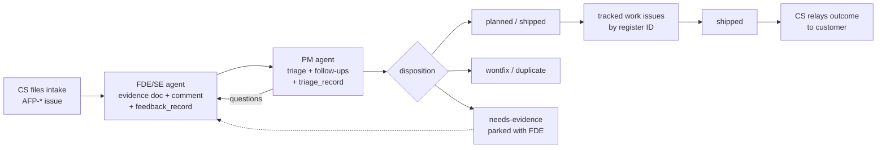

# customer-feedback-linear

Two Claude Code skills that close the loop on **Agentforce customer feedback via Linear** — so FDEs/SEs and PMs don't need a meeting to understand it:

| Skill | Who runs it | What it does |
|---|---|---|
| [`FDE-customer-feedback-linear/`](FDE-customer-feedback-linear/SKILL.md) | FDE / Solution Engineer | Packages detailed feedback onto a customer-feedback issue (`AFP-*`) as **one in-app evidence Document + a summary comment** — including a pre-answered **"Questions a PM will ask"** section and a machine-readable **`feedback_record` block**. |
| [`PM-feedback-triage-linear/`](PM-feedback-triage-linear/SKILL.md) | PM (via their coding agent) | **Consumes** that feedback: answers questions about any item with citations, builds cross-customer rollups (by feature, gap type, severity, impact), and posts follow-up questions back on the thread asynchronously. |

The two sides meet on a shared contract: every evidence doc ends with a fenced `feedback_record: v1` YAML block (fixed vocabulary for `gap_type`, `severity`, `customer_impact`, `repro_status`), **and** every triage disposition ends with a fenced `triage_record: v1` YAML block (disposition, accepted/declined asks, owner, loop status) — both defined in the respective SKILL.md files. Human-readable narrative for people; parseable record for agents. Stable item IDs (`A#`/`Q#`/`F#`/`P#`) are the join key between the human-readable **register** (the ask/answer ledger in comments) and the machine records — the same `A1` appears in both.

Registers in comments are a compact **3-column rolling snapshot** (`Item · Status · Next`) — the ID is a bold prefix, the round folds into Status, and every round comment ends with the full register, so the newest comment is always the live state. Labels, not sentences; the machine records carry the full text.

**Reading a thread.** Each issue's description opens with a 🧵 loop-status header (above a divider preserving the CS intake); each comment leads with a round envelope (round · direction · purpose · ball · open), uses numbered sections, and ends with the 📒 register snapshot.



The loop **converges, rather than counts** — each exchange must shrink the open set of items, and stalling or backsliding is the cue to escalate to a sync — and ends only when the disposition is written to the issue's own fields — not just the thread.

## The no-meeting flow

The loop assumes **two participants** (an FDE/SE and a PM), each driving their own coding agent; a single person can role-play both to rehearse it, but ownership hand-offs are real only with two identities.

1. **FDE/SE** gathers evidence for a product gap (transcripts, test results, traces) and tells their coding agent: *"share this customer feedback on AFP-123 as an in-app doc + summary comment."*
2. The agent (via the FDE skill) reads the issue's intake fields, drafts the structured doc — verdict → evidence → root cause → asks → **pre-answered PM questions** → machine-readable record — links it to the issue, and posts the summary comment.
3. **PM** asks their coding agent (via the PM skill): *"what's AFP-123 about?"*, *"top asks across Testing Center feedback this quarter?"*, or *"draft my follow-ups for AFP-123."*
4. Remaining questions travel as **thread comments**, not calls.
5. **PM disposition** — the PM's agent records the decision on the issue itself (state/priority/label) and posts a `triage_record`; the loop is closed when open questions are resolved and the disposition is on the issue, or explicitly parked (`needs-evidence`).
6. **Delivery & close-back** — accepted asks become tracked work issues (titled by register ID), their completion rolls status up to the feedback issue, and a close-back comment tells CS what shipped so the customer hears the outcome. The loop closes at the customer, not at the decision.

## Install

Each skill is a folder containing a `SKILL.md`. Copy the folder(s) you need into your skills location:

- **Personal:** `~/.claude/skills/FDE-customer-feedback-linear/` and/or `~/.claude/skills/PM-feedback-triage-linear/`
- **Team-shared:** your team's synced skills repo or Claude Code plugin skills directory.

Each user needs the **Linear MCP** connected. Feedback issues live in the `eventsmobileapp` workspace (team "Agentforce Feedback") — if `get_issue AFP-###` fails, reconnect via `/mcp` → linear → pick `eventsmobileapp`.

## Use

```
/FDE-customer-feedback-linear     # FDE/SE: share feedback onto an AFP issue
/PM-feedback-triage-linear        # PM: understand / roll up / follow up on feedback
```

Or in plain language: *"share this customer feedback on AFP-123…"* / *"build a rollup of this month's Agentforce feedback."*

## Requirements

- Claude Code with skills enabled.
- Linear MCP connected (with access to the target workspace).
- `curl` (FDE skill only, and only for binary evidence like screenshots).

## Notes / known constraints

- Linear renders markdown (tables, code, `<details>`) but **not** HTML attachments inline — deliverables are always markdown docs.
- The Linear MCP has **no delete/archive-document** capability; retiring a doc means renaming it to a redirect stub and archiving in-app.
- Always sanitize org IDs / customer PII / tokens before posting. Rollups may name customers — keep them internal.
